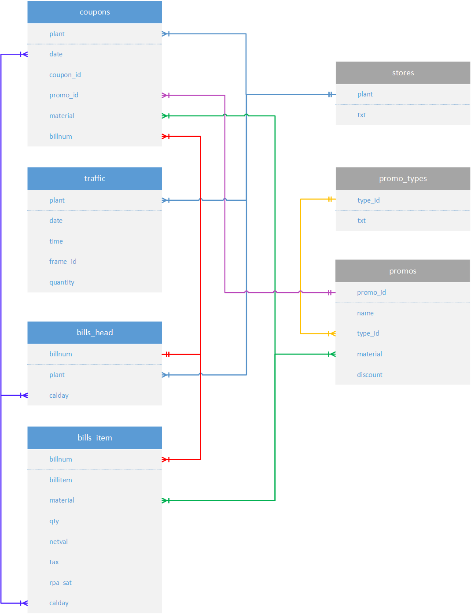
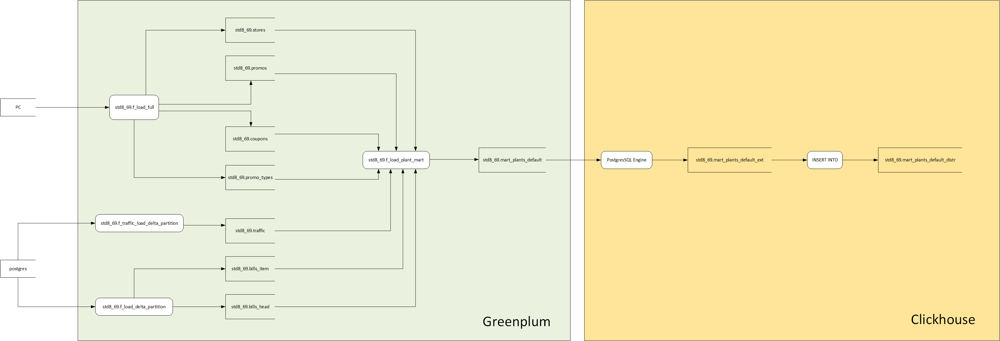

# Учебный проект курса Sapiens Solutions: "Аналитика и работа с данными (СУБД Greenplum)"

## Обзор

Этот репозиторий содержит проект, разработанный в рамках курса "Аналитика и работа с данными (СУБД Greenplum)" от компании Sapiens Solutions. Проект представляет собой создание пайплайна данных с использованием **Greenplum**, **Airflow**, **Superset** и **ClickHouse** для обработки и анализа данных о продажах. Пайплайн включает этапы загрузки данных, их трансформации, хранения и визуализации, охватывая полный цикл работы с данными в инженерии данных. Основная цель проекта — создание витрины данных (`mart_plants_default`), которая предоставляет аналитику по ключевым метрикам производительности магазинов, таким как выручка, скидки, трафик и коэффициент конверсии.

**Важно:** Этот проект является учебным и **не готов к использованию в продакшене**. Он демонстрирует основные концепции инженерии данных и аналитики, но требует доработок для реального применения (см. раздел "Области для доработки" ниже).

## Содержимое репозитория

Репозиторий включает следующие файлы:

- **`Dataflow_diagram.png`**: Диаграмма, визуализирующая рабочий процесс Airflow DAG для пайплайна данных.
- **`Dataflow_diagram.vsdx`**: Редактируемый файл Visio с диаграммой Airflow DAG.
- **`ERD.png`**: Диаграмма ERD (Entity-Relationship Diagram) схемы базы данных в Greenplum.
- **`ERD.vsdx`**: Редактируемый файл Visio с ERD.
- **`Project_presentation.pptx`**: Презентация PowerPoint с обзором проекта, подготовленная для защиты. Рекомендуется для просмотра.
- **`README.md`**: Этот файл с описанием проекта.
- **`f_load_plants_mart.sql`**: SQL-скрипт функции `f_load_plant_mart`, создающей витрину `mart_plants_default` в Greenplum.
- **`mart_plants_20210101_20210228_202412813.xlsx`**: Excel-файл с результатами витрины за период с 1 января 2021 по 28 февраля 2021 для сравнения с ожидаемыми значениями.
- **`project_documents.doc`**: Дополнительная документация проекта в формате Word.
- **`project_documents.one`**: Заметки и документация проекта в формате OneNote.
- **`promo_types.csv`**: Пример данных для таблицы `promo_types`.
- **`promos.csv`**: Пример данных для таблицы `promos`.
- **`coupons.csv`**: Пример данных для таблицы `coupons`.
- **`Итоговый отчет.xlsx`**: Итоговый отчет в формате Excel (на русском) с результатами проекта.

## Описание проекта

### Цель
Проект направлен на создание пайплайна данных для обработки данных о продажах и формирования витрины (`mart_plants_default`) для анализа продаж и конверсии магазинов. Пайплайн включает загрузку данных из PostgreSQL и CSV-файлов через gpfdist коннектор, их хранение в Greenplum, обработку с помощью Airflow, загрузку в ClickHouse и визуализацию в Superset.

### Используемые технологии
- **Greenplum**: Основной склад данных для хранения и обработки.
- **Airflow**: Оркестрация пайплайна данных, управление процессами ETL.
- **Superset**: Визуализация данных и создание дашбордов для витрины.
- **ClickHouse**: Дополнительное хранилище и высокопроизводительные запросы к витрине.
- **PostgreSQL**: Источник данных для некоторых таблиц.

### Пайплайн данных
Пайплайн состоит из следующих этапов:

1. **Загрузка данных**:
   - **Измерения (Dimension Tables)**: Таблицы `stores`, `promos`, `coupons`, `promo_types` загружаются из CSV-файлов с помощью функции `f_load_full` через коннектор `gpfdist`.
   - **Факты (Fact Tables)**: Таблицы `bills_head`, `bills_item`, `traffic` загружаются из PostgreSQL с использованием функций `f_load_delta_partition` и `f_traffic_load_delta_partition` через PXF-коннектор.
   - Данные партиционируются по дате (интервал 1 месяц) и распределяются по ключам (например, `billnum` для `bills_head` и `bills_item`, `coupon_id` для `coupons`).
  

2. **Трансформация данных**:
   - Функция `f_load_plant_mart` создает витрину `mart_plants_default` в Greenplum, агрегируя данные из таблиц фактов и измерений за заданный период (например, с 1 января 2021 по 28 февраля 2021).
   - Метрики витрины включают:
     - Выручка (`revenue`)
     - Скидки (`discount`)
     - Прибыль (`profit`)
     - Количество проданных товаров (`quantity`)
     - Количество чеков (`bills_count`)
     - Трафик магазина (`traffic`)
     - Промо-метрики (`promo_sold`, `promo_rate`)
	 - Коэффициент конверсии магазина (`btt`)
     - Средние показатели (`avg_qty_per_bill`, `avg_bill_rub`, `avg_customer_rub`)

3. **Хранение данных**:
   - Витрина сохраняется в Greenplum (`mart_plants_default`) и реплицируется в ClickHouse для высокопроизводительных запросов.
   - В ClickHouse данные хранятся в таблицах `mart_plants_default_final` (локальная на каждом шарде) и `mart_plants_default_final_distr` (распределенная таблица по всем шардам).

4. **Визуализация данных**:
   - Дашборды Superset визуализируют метрики витрины, предоставляя интерактивный анализ производительности магазинов. Пример показан в презентации `Project_presentation.pptx`.

5. **Оркестрация**:
   - Airflow DAG (`std8_69_project_dag`) управляет пайплайном, выполняя задачи последовательно:
     - Загрузка таблиц измерений (`full_insert`).
     - Загрузка таблиц фактов (`delta_partition_insert`).
     - Создание витрины (`load_gp_mart`).
    

### Схема базы данных
- **Таблицы фактов**:
  - `traffic`: Данные о трафике (из PostgreSQL через PXF).
  - `bills_head`: Заголовки чеков (из PostgreSQL через PXF).
  - `bills_item`: Позиции чеков (из PostgreSQL через PXF).
- **Таблицы измерений**:
  - `stores`: Информация о магазинах (из CSV через `gpfdist`).
  - `promos`: Детали промоакций (из CSV через `gpfdist`).
  - `coupons`: Данные о купонах (из CSV через `gpfdist`).
  - `promo_types`: Типы промоакций (из CSV через `gpfdist`).
- **Витрина**:
  - `mart_plants_default`: Итоговая витрина в Greenplum, реплицированная в ClickHouse.

### Ключевые функции
- **`f_load_full`**: Загружает данные из CSV в Greenplum через `gpfdist`.
- **`f_load_delta_partition`**: Загружает данные из PostgreSQL в Greenplum с дельта-партиционированием.
- **`f_traffic_load_delta_partition`**: Специализированная функция для загрузки трафика с преобразованием дат.
- **`f_load_plant_mart`**: Создает витрину `mart_plants_default`, агрегируя данные.

### Распределение и партиционирование
- **Распределение**:
  - `bills_head`, `bills_item`: По `billnum`.
  - `coupons`: По `coupon_id`.
  - `stores`, `promos`, `promo_types`: Реплицированы (словари).
  - `traffic`: Случайное распределение (нет столбца с равномерным распределением).
  - `mart_plants_default`: По `plant`.
- **Партиционирование**:
  - Таблицы фактов (`traffic`, `bills_head`, `bills_item`, `coupons`) партиционированы по дате с интервалом 1 месяц.

### Интеграция с ClickHouse
- Витрина `mart_plants_default` реплицируется в ClickHouse для высокопроизводительных запросов.
- Таблицы в ClickHouse:
  - `mart_plants_default_ext`: Внешняя таблица, связанная с Greenplum.
  - `mart_plants_default_final`: Локальная таблица на каждом шарде с движком `ReplicatedMergeTree`.
  - `mart_plants_default_final_distr`: Распределенная таблица, агрегирующая данные по всем шардам.

### Airflow DAG
DAG (`std8_69_project_dag`) управляет пайплайном:
- **Задачи**:
  - `start`: Пустая задача для старта.
  - `full_insert`: Группа задач для загрузки измерений (`stores`, `promos`, `coupons`, `promo_types`).
  - `delta_partition_insert`: Группа задач для загрузки фактов (`bills_head`, `bills_item`, `traffic`).
  - `load_gp_mart`: Создание витрины.
  - `end`: Пустая задача для завершения.
- **Расписание**: DAG не запланирован (`schedule_interval=None`), запускается вручную.

### Дашборды Superset
Дашборды визуализируют данные витрины `mart_plants_default`:
- Тренды выручки и прибыли.
- Трафик и коэффициент конверсии.
- Промо-метрики (`promo_rate`, `promo_sold`).
- Средние показатели (`avg_bill_rub`, `avg_customer_rub`).

## Области для доработки
Проект является учебным и требует улучшений для продакшена:

1. **Обновление статистики**:
   - Перед и после выполнения скриптов в Greenplum нужно обновлять статистику (например, с помощью `ANALYZE`) для оптимизации запросов.
2. **Удаление временных таблиц**:
   - Временные таблицы (например, `v_ext_table`, `v_temp_table`) нужно удалять после использования, чтобы не захламлять базу.
3. **Логика подневной витрины**:
   - Добавить возможность генерации витрины по дням для заданного диапазона дат с последующей агрегацией в ClickHouse.
4. **Обработка ошибок**:
   - Улучшить обработку ошибок в функциях SQL и DAG (например, добавить повторные попытки, уведомления).
5. **Логирование**:
   - Расширить логирование (например, в `f_load_write_log`) для записи времени выполнения и деталей ошибок.
6. **Безопасность**:
   - Убрать захардкоженные учетные данные (например, `DB_USERNAME`, `DB_PASSWORD`) из DAG, использовать Airflow Variables или Connections.
   - Ограничить доступ к Greenplum и ClickHouse через контроль ролей.
7. **Оптимизация производительности**:
   - Оптимизировать шардирование и репликацию в ClickHouse.
   - Поменять ориентацию таблиц на столбцовые, т.к. по ошибке были выставлено строчное хранение данных.
8. **Мониторинг и оповещения**:
   - Добавить мониторинг DAG (например, оповещения в Slack/Email при сбоях).
   - Настроить мониторинг производительности запросов в Greenplum и ClickHouse.
9. **Документация**:
   - Расширить описание функций с примерами ввода/вывода и обработкой крайних случаев.
   - Документировать дашборды Superset и их назначение.
10. **Тестирование**:
    - Добавить юнит-тесты для функций SQL и интеграционные тесты для DAG.
    - Проверять согласованность данных между Greenplum и ClickHouse.

## Как запустить проект
Доступ к БД Greenplum, Clickhouse потерян, т.к. курс был окончен, но есть следующий гайд:
1. **Настройка Greenplum**:
   - Создать схему `std8_69` и развернуть DDL для таблиц (`traffic`, `bills_head`, `bills_item`, `stores`, `promos`, `coupons`, `promo_types`).
   - Установить функции SQL (`f_load_full`, `f_load_delta_partition`, `f_traffic_load_delta_partition`, `f_load_plant_mart`).
2. **Настройка Airflow**:
   - Развернуть DAG (`std8_69_project_dag`) и настроить подключение к Greenplum (`gp_sapiens_std8_69`).
   - Разместить CSV-файлы (`stores.csv`, `promos.csv`, `coupons.csv`, `promo_types.csv`) в директории сервера `gpfdist` (`172.16.128.142:8080`).
   - Запустить DAG вручную.
3. **Настройка ClickHouse**:
   - Создать таблицы `mart_plants_default_ext`, `mart_plants_default_final`, `mart_plants_default_final_distr`.
   - Настроить подключение между Greenplum и ClickHouse.
4. **Настройка Superset**:
   - Построить дэшборды на примере слайда в презентации `Project_presentation.pptx`.
   - Настроить подключение к ClickHouse для запросов к `mart_plants_default_final_distr`.

## Благодарности
Проект выполнен в рамках курса "Аналитика и работа с данными (СУБД Greenplum)" от Sapiens Solutions. Огромная благодарность преподавателям и менторам за поддержку на протяжении курса, а также предоставление доступа к серверам! 
