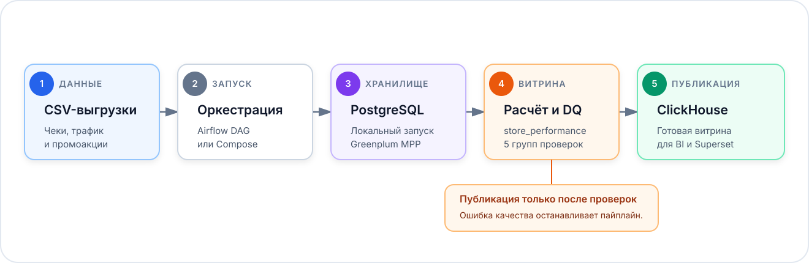

# Платформа аналитики продаж

Проект строит витрину эффективности магазинов из чеков, трафика и промоакций. PostgreSQL используется как лёгкое локальное хранилище, Greenplum SQL описывает целевую MPP-модель, а готовая витрина публикуется в ClickHouse для BI.

Первая версия была моей итоговой работой на курсе Sapiens Solutions по Greenplum. Позже я пересобрал её как воспроизводимый репозиторий с тестами и автоматическими проверками. В `sample_data` лежит нормализованная выгрузка из анонимизированного учебного набора, а не синтетические данные.

## Поток данных



Airflow координирует загрузку CSV в PostgreSQL или Greenplum, построение витрины эффективности магазинов и публикацию результата в ClickHouse. Облегчённый Compose-стенд запускает те же этапы напрямую и не скачивает полный образ Airflow. DAG из `dags/` предназначен для развёртывания пакета в существующем Airflow-окружении.

В витрине рассчитываются оборот до и после скидок, скидки, количество проданных товаров и чеков, трафик, конверсия, доля промотоваров и средний чек. Поле называется `net_revenue`, а не profit: выручка после скидок не равна бухгалтерской прибыли.

## Запуск пайплайна

Требуется Docker с Compose.

```bash
docker compose up --build --abort-on-container-exit pipeline
```

Команда создаёт исходные таблицы и слой хранилища, загружает данные, строит `sales.mart_store_performance`, выполняет проверки и публикует результат в ClickHouse.

Проверить витрину в PostgreSQL:

```bash
docker compose exec postgres psql -U sales -d sales -c \
  "select * from sales.mart_store_performance order by plant"
```

Проверить таблицу в ClickHouse:

```bash
docker compose exec clickhouse clickhouse-client --query \
  "select * from sales.mart_store_performance order by plant format PrettyCompact"
```

`docker compose down -v` останавливает контейнеры и удаляет локальные данные стенда.

## Инженерные решения

В Greenplum заголовки и строки чеков распределяются по `billnum`, небольшие справочники реплицируются, факты партиционируются по дате и хранятся в append-optimized column tables. Локальный PostgreSQL не имитирует распределение Greenplum. Он нужен для воспроизводимого запуска преобразований и тестов.

Витрина начинается со справочника магазинов и присоединяет агрегаты через `LEFT JOIN`, поэтому магазин не исчезает при отсутствии трафика или промоданных. Дубликаты купонов разрешаются детерминированно с помощью `row_number()`.

Перед публикацией проверяются:

- Уникальность бизнес-ключей и grain витрины.
- Неотрицательные количества, выручка, трафик и скидки.
- Ссылочная целостность между заголовками и строками чеков.
- Сверка выручки с исходными строками.
- Допустимые диапазоны конверсии и доли промотоваров.

Любая ошибка останавливает пайплайн.

## Запуск отдельных этапов

```bash
python -m sales_pipeline init
python -m sales_pipeline mart
python -m sales_pipeline publish
python -m sales_pipeline all
```

Параметры подключения задаются переменными из `.env.example`.

## Структура

```text
dags/               Airflow DAG
docs/               диаграммы и материалы исходного стенда
sample_data/        нормализованный анонимизированный набор
sales_pipeline/     запуск этапов и проверки качества
sql/marts/          переносимый запрос витрины
sql/postgres/       локальная схема
sql/greenplum/      целевая MPP-схема
tests/              тесты витрины и конфигурации
```

## Проверки

```bash
python -m pip install -e ".[dev]"
pytest
ruff check .
ruff format --check .
```

## Данные и иллюстрации

Набор охватывает 15 анонимизированных магазинов за январь и февраль 2021 года: 3 213 чеков, 10 516 агрегированных строк чеков, 885 дневных записей трафика и 597 купонов. Дубликаты строк исходного Excel сгруппированы по чеку и материалу. Эта пара полей служит бизнес-ключом таблицы хранилища.

Исходный Excel, конспекты и презентация не публикуются: в них были реквизиты учебного стенда. Сопоставление листов и CSV описано в [sample_data/README.md](sample_data/README.md).

ER-диаграмма и скриншот Superset взяты из исходного учебного окружения. Старый граф Airflow оставлен как историческое подтверждение и содержит учебное имя схемы; поддерживаемый DAG и локальный стенд используют нейтральные имена.


